## Investigation of Actors

*Return to [HOME](https://lauramarott.github.io/SocialGraphs/)*

One hypothesis about movies is that the use of actors influences the popularity of the movies and thus the ratings made by the IMDb-users. To investigate this, a Network Analysis is conducted here which allows you to decide whether you will accept deny this hypothesis.  

### Description of the Network
The network is an undirected network, meaning that no node is pointing at other nodes without the other nodes pointing back. In this network the movies are the nodes and the edges between them are shared actors. This means that the network is weighted since two movies can share more than one actor. The edge weights are therefore between 1 and 3, since the dataset has only noted the three first mentioned actors for each movie. 
The network is simple since it is not possible for a movie to link to itself. Below, the network is visualised. 

### Overall Network and Biggest Component

First the overall network is plotted below:

<figure style="text-align: center;">
  
</figure>

This plot shows how some of the movies have no shared actors with other movies. The reasons for them to not be connected could be if they are from other countries than USA or UK, or if the actors are unknown. These movies are not interesting for the further investigation. The not-connected movies represents 18 % of the dataset, and when removing them the graph still consists of 774 nodes. Therefore, the biggest component is considered representative. This is plotted below:

<figure style="text-align: center;">
  
</figure>

The attentive reader will notice color change of the nodes. The explanation for this is, that the nodes are now colored based on the rankings of the movies. The ranking is divided into three intervals based on the findings from the [Basic Stats](https://lauramarott.github.io/SocialGraphs/BasicStats) with almost the same amount of movie in each rank-category. 
* The high ranked movies are BLUE
* The medium ranked movies are GREEN
* The low ranked movies are RED

### Degrees and Centralities Plots
#### Degree

The network is plotted with nodesize depending on the degree of the nodes, meaning how many connections a movie has to other movies. 

<figure style="text-align: center;">
  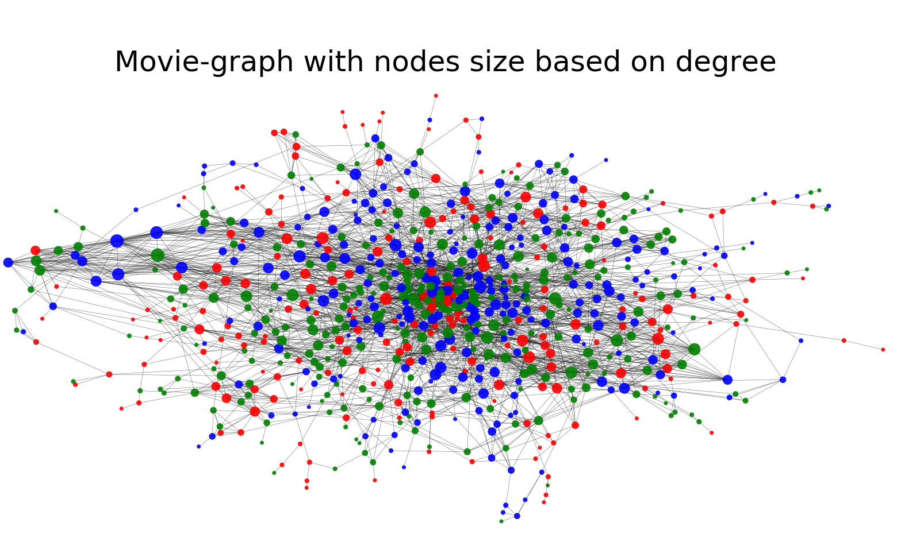
</figure>

The degree sizes shows that there area difference in the number of connections between the movies, however no clear pattern regarding the ratings can be seen with the naked eye, meaning that this plot does not confirm the hypothesis of good movies using the same popular actors. 
Another way to invesstigate this is the look at the top and bottom 10 movies and there degree and ranking:

<figure style="text-align: center;">
  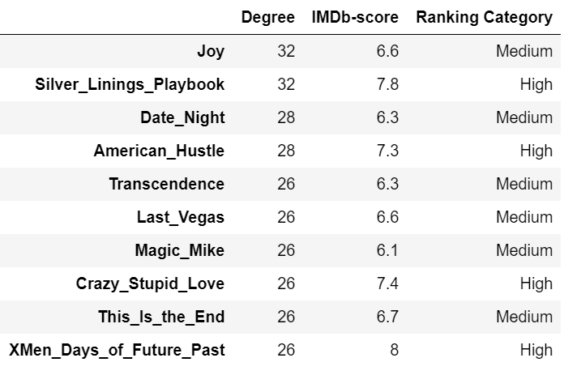
</figure>

The table above shows that the top 10 movies based on degrees are all ranked either high or medium, which might indicate that the actors after all have some influence on the ranking.

<figure style="text-align: center;">
  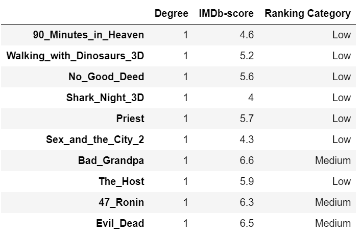
</figure>

This table above on the other hand shows that the bottom 10 movies based on degrees have no clear pattern in which ranks are seen. 

To sum up there might be a very small indicator of popular actors having influence on the popularity when looking at the high/medium ranked movies.

#### Betweenness Centrality

The betweenness is meant to examined the centrality of a movie based on how many shortest paths going through this movie. 

<figure style="text-align: center;">
  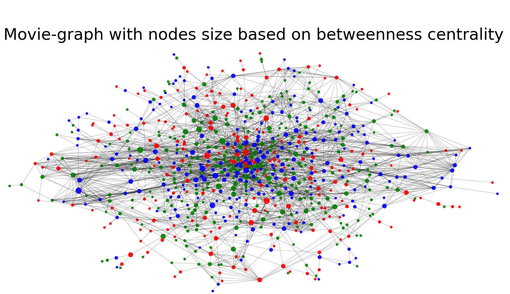
</figure>

Here no pattern is seen at all. The top and bottom betweenness centralities are also investigated:

<figure style="text-align: center;">
  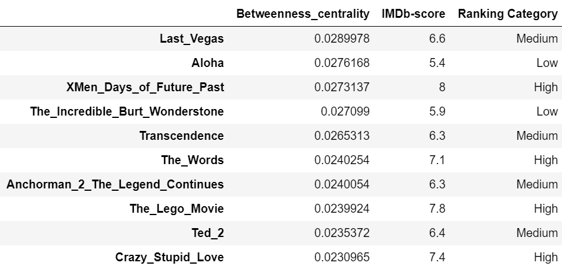
</figure>

It is seen from the above table that nothing is to be said here, since both high, medium and low ranked movies are occuring in the table. 

<figure style="text-align: center;">
  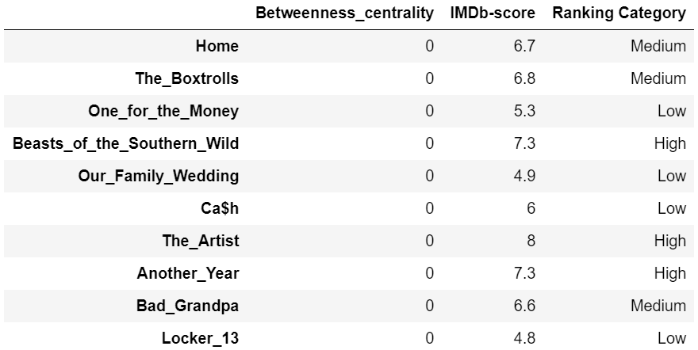
</figure>

The same no-pattern can be seen from the bottom movies of betweenness centrality, where no shortest paths are going through any of these movies. 

To sum up, the betweenness centralities show no tendencies on the rankings being influenced by this popularity.

#### Eigenvector Centrality

The eigenvector centrality examines the influence of a node in a network meaning that a node with a high eigenvector centrality is linked to other nodes with high eigenvector centrality. This means that the influence of a node is determined from the influence of it neighbors. This is visualised below:

<figure style="text-align: center;">
  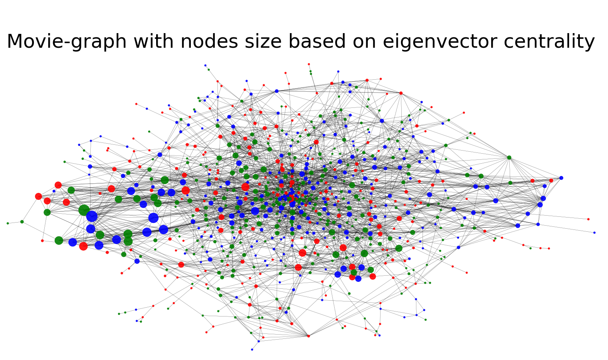
</figure>

It is clear that some nodes are popular in terms of their eigenvector centrality. These nodes are linking to each other. From this plot, the high and medium ranked movies have the highest eigenvector centralities meaning that they might use the same popular actors. The top and bottom eigenvector centralities are investigated below:

<figure style="text-align: center;">
  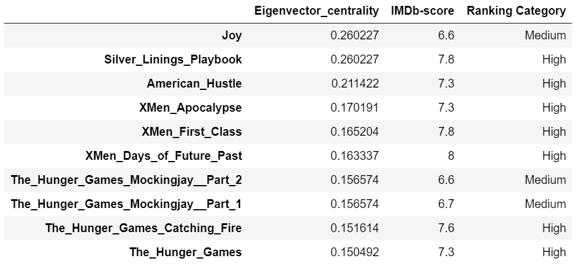
</figure>

The table above shows a clear tendency of the high ranked movies having the highest eigenvector centralities. 

<figure style="text-align: center;">
  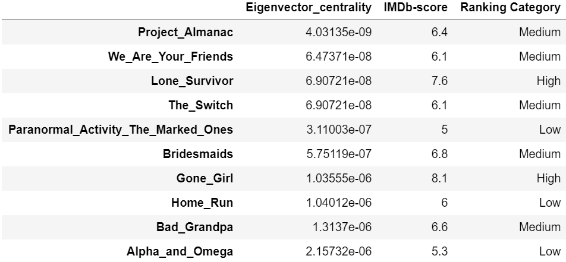
</figure>

From the bottom eigenvector centralities no clear patterns is seen, since both medium and low ranked movies are to find here. Many of these movies also have a low degree, which might be the reason for them to have such a low eigenvector centrality since they have a few connections. 

To sum up, the high ranked movies tend to have a high influence at each other, which might mean that they use popular actors. However, it is difficult to say anything about the rest of the movies. 

### Understanding the Network further

For the more interested reader, you can gain some deeper insight of the network by looking into the degree distribution, the scale-freeness and whether the network is assortative or disassortative.

#### Degree Distribution

This distribution is another way to look at the degrees and see how they behaves.

<figure style="text-align: center;">
  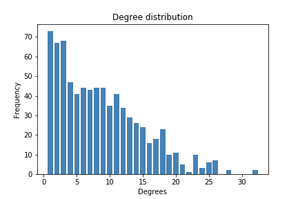
</figure>

It is seen that the majority of the movies are connected to between 1 and 4 other movies. A few movies uses many popular actors and are connected to over 20 other movies. The average degree of the network is 8.65, meaning that each movie on average is connected to 8 other movies. This high average may be due to the three possibilites of connecting to other - the three actors. 

#### Scale-freeness

Already from the above degree distribution a tendency of a power-law distribution can be seen. The degree distribution can be translated to a loglog plot to strengthen this assumption:

<figure style="text-align: center;">
  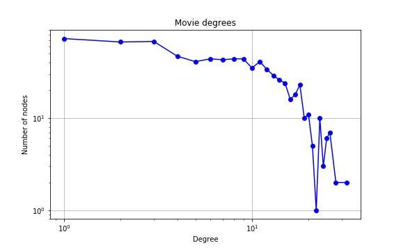
</figure>

The loglog plot shows that the degrees are following a power-law distribution due to its declining behaviour. Thus, the network is scale-free which means that hubs are expected since the connections has preferential attachment (aligning with the friendship paradox). As we have seen above, some movies are using popular actors and are more likely to be connected to many other movies and thereby becoming a hub. 
However, this has nothing to do directly with the rating, but is just explaining the behaviour of the network. 

#### Assortative or Disassortative Network? 

To describe the structure of the network's connections even more, the Degree Correlation Cofficient (using Pearson) is found to be 0.36. Since this number is higher than 0, it indicates that the network is disassortative meaning that the network has a hub and spoke structure. This means that small nodes are more likely to connect to the hubs. 

This is different from what was assumed. It was assumed that big nodes shared the same popular actors. Instead it seems like the hubs are based on the fact that the actors are playing in many movies with many different other actors. 

This analysis indicates that many things may play a role when it comes to the popularity of a movie - not only the actors. If the network had been representing the friendship of the actors it would probably have been assortative.

### Conclusion

Based on the degrees and the eigenvector centralities it can be seen that the actors might have an influence on what makes a movie successful. This is based on the high ranked and medium ranked nodes being the biggest in these analyses. 

Looking deeper into the structure and behaviour of the network, however, tells that other factors influences the success of a movie - not only the actors. 
Therefore, you may find it necessary to return to [home](https://lauramarott.github.io/SocialGraphs/) and investigate the network using other methods. Good luck!
