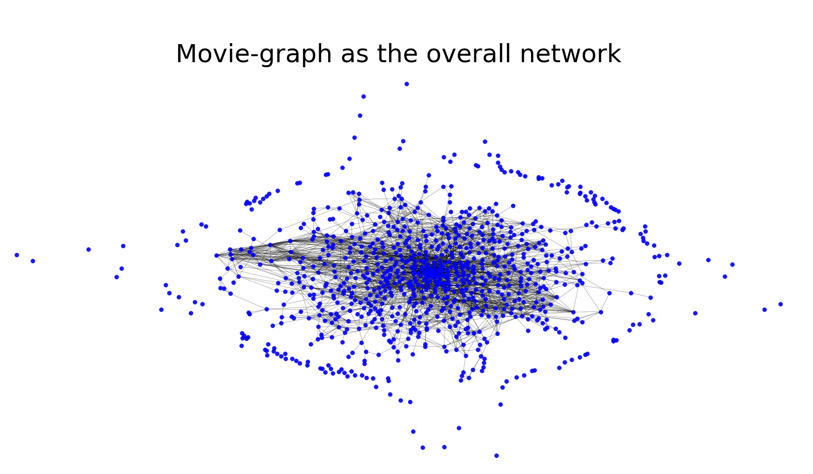
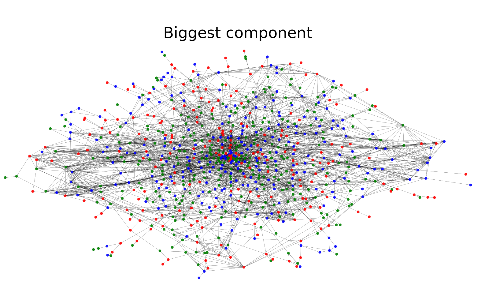

## Investigation of Actors

*Return to [HOME](https://lauramarott.github.io/SocialGraphs/)*

One hypothesis is that the use of actors influences the popularity of the movies and thus the ratings made by the IMDb-users. To investigate this, a Network Analysis is conducted here. 

### Description of the Network
The network is an undirected network, where the movies are the nodes and the edges between them are shared actors. This means that the network is weighted since two movies can share more than one actor. The edge weights are therefore between 1 and 3, since the dataset has only noted the three first mentioned actors for each movie. 
The network is simple since it is not possible for a movie to link to itself. Below, the network is visualised. 

### Overall Network and Biggest Component

First the overall network is plotted below:

<figure style="text-align: center;">
  
</figure>

This plot shows how some of the movies have no shared actors with other movies. The reasons for them to not be connected could be if they are from other countries than USA or UK, or if the actors are unknown. These movies are not interesting for the further investigation. The not-connected movies represents 18 % of the dataset, and when removing them the graph still consists of 774 nodes. Therefore, the biggest component is considered representative. This is plotted below:

<figure style="text-align: center;">
  
</figure>

The attentive reader will notice color change of the nodes. The explanation for this is, that the nodes are now colored based on the rankings of the movies. The ranking is divided into three intervals based on the findings from the [Basic Stats](https://lauramarott.github.io/SocialGraphs/BasicStats) with almost the same amount of movie in each rank-category. 
* The high ranked movies are BLUE
* The medium ranked movies are GREEN
* The low ranked movies are RED

### Degrees and Centralities Plots

### Understanding the Network further

### Conclusion
