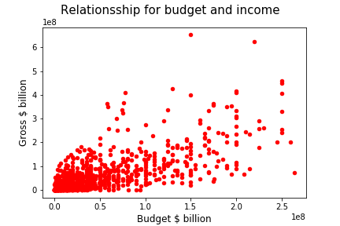
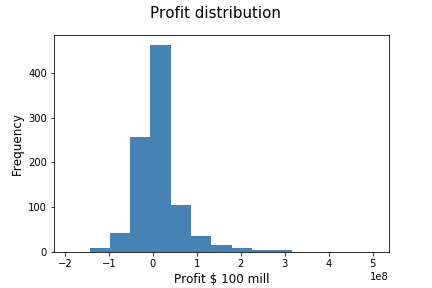
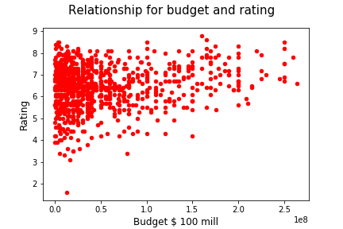
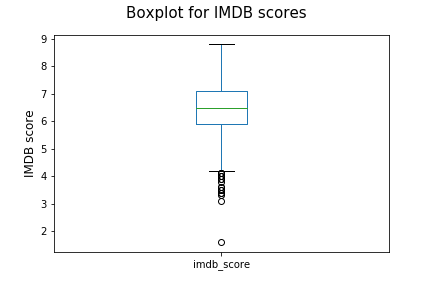

## Understanding the Movie Data
*Return to [HOME](https://lauramarott.github.io/SocialGraphs/)*

Before even trying to tell anything about what makes a movie successful, it is important to understand the data used for the analyses, don't you think? To understand the movie data it is here examined on the following parameters:
* Genre
* Budget and Income
* Profit 
* Budget and Ratings
* Ratings

This analysis strives to also understand patterns in the industry based on the above factors. Therefore, the purpose of this is to give YOU a better insight in what is going on in the movie industry. 

### Genres

Each movie can be assigned several genres by IMDb. This means that one movie can appear in more bars in the plot below:

<figure style="text-align: center;">
  
</figure>

The plot shows a very dominating top 4 which indicates that all movies can be categorised as either drama, comedy, thriller or action. If the movies were only allowed one genre, this picture might be very different.

### Budget and Income

A scatter plot is made to investigate the relationship between the budget and the income for the movies:

<figure style="text-align: center;">
  
</figure>

It is seen that are some connection between the budget and the gross income for a movie. The relation is however not linear, as the gross income does not 'grow' as fast compared to the budget. The plot indicates that there might be a limit for how big an income a movie can make no matter the budget. However, the budget has no limit. 

### Profit

The profit distribution is plotted below:

<figure style="text-align: center;">
  
</figure>

It is an interesting finding, that so many movies have a profit below or around 0. Average profit is 13 million dollars. This strengthens the finding from above; there must be a limit for how big profit a movie can have.  

### Budget and Ratings

The relationship between budget and ratings are also interesting to take a look at:

<figure style="text-align: center;">
  
</figure>

The plot shows a relation between the budget and rating. It seems like high budget movies are 'secured' high ratings. This might be due to the special effects afforded to make that extra touch on the movies.

### Ratings

The ratings are essential to analyse, since this whole investigation of movies are based on the assumption that a movie is successful if it has a high IMDb-score. The boxplot below shows the distribution of the ratings:

<figure style="text-align: center;">
  
</figure>

The average rating is very high (6.5), and it is even more interesting that the 25 % quantile is 5.9. The ratings are therefore very high, which indicates that either few bad movies exists or people are too nice when rating. This is an interesting finding to keep in mind in later analyses. 

### Conclusion

Hopefully, you have now get an idea of how the data looks like which reflect the market of movies. These insights are the first step to understand what makes a movie successful. 

You can now go back to [home](https://lauramarott.github.io/SocialGraphs/) and continue the investigation. Enjoy!
