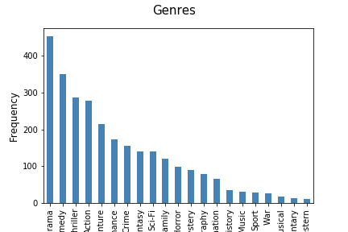

## Basic Stats

To understand the data it is here examined on the following parameters:
* Genre
* Budget and Income
* Budget and Ratings
* Profit 
* Ratings

### Genre

Each movie can be assigned several genres by IMDb. This means that one movie can appear in more bars in the plot below:

<figure style="text-align: center;">
  
  <h5 style="text-align: center;"</h5>
</figure>

