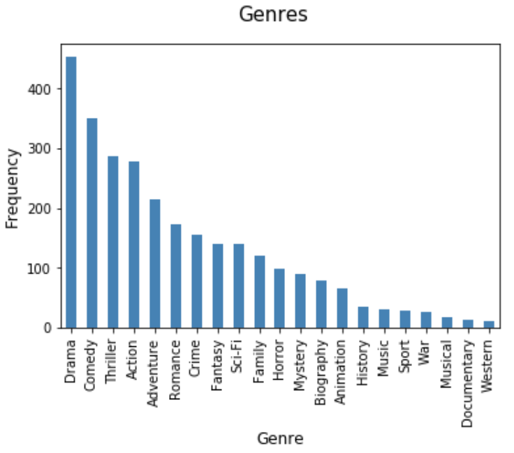

## Basic Stats
*Return to [HOME](https://lauramarott.github.io/SocialGraphs/)*

To understand the data it is here examined on the following parameters:
* Genre
* Budget and Income
* Profit 
* Budget and Ratings
* Ratings

### Genres

Each movie can be assigned several genres by IMDb. This means that one movie can appear in more bars in the plot below:

<figure style="text-align: center;">
  
</figure>

The plot shows a very dominating top 4 which indicates that all movies can be categorised as either drama, comedy, thriller or action. If the movies were only allowed one genre, this picture might be very different.

### Budget and Income

A scatter plot is made to investigate the relationship between the budget and the income for the movies:

<figure style="text-align: center;">
  
</figure>

It is seen that are some connection between the budget and the gross income for a movie. The relation is however not linear, as the gross income does not 'grow' as fast compared to the budget. The plot indicates that there might be a limit for how big an income a movie can make no matter the budget. However, the budget has no limit. 

### Profit

The profit distribution is plotted below:

<figure style="text-align: center;">
  
</figure>

It is an interesting finding, that so many movies have a profit below or around 0. Average profit is 13 million dollars. This strengthens the finding from above; there must be a limit for how big profit a movie can have.  

### Budget and Ratings

The relationship between budget and ratings are also interesting to take a look at:

<figure style="text-align: center;">
  
</figure>

The plot shows a relation between the budget and rating. It seems like high budget movies are 'secured' high ratings. This might be due to the special effects afforded to make that extra touch on the movies.

### Ratings

<figure style="text-align: center;">
  
</figure>
