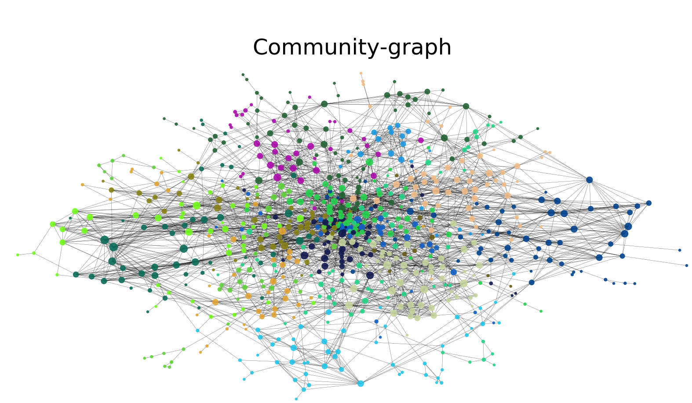
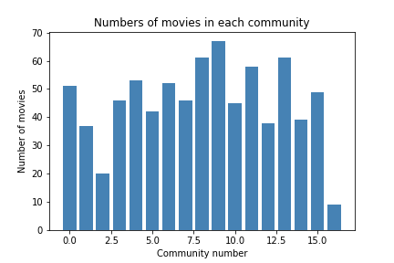
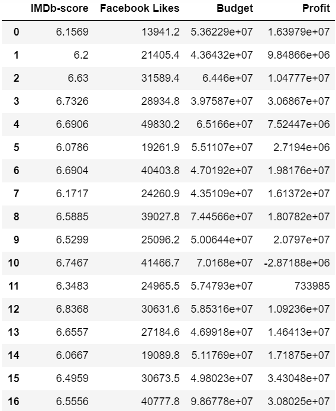
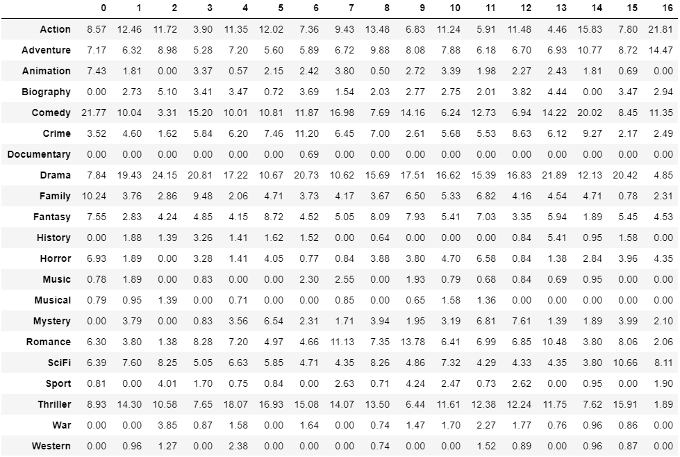
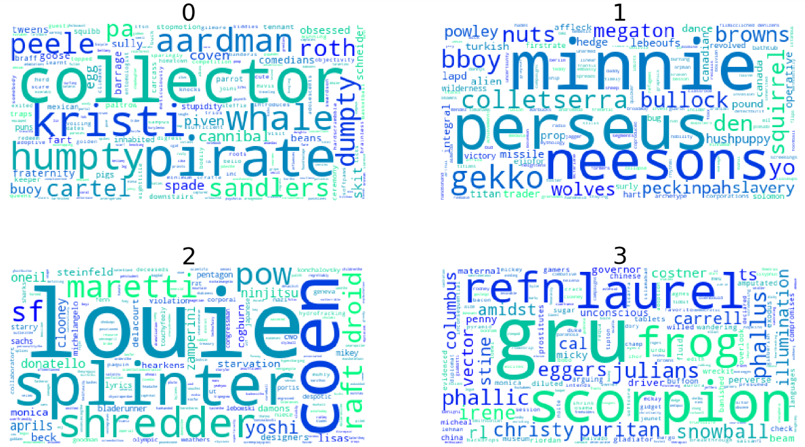
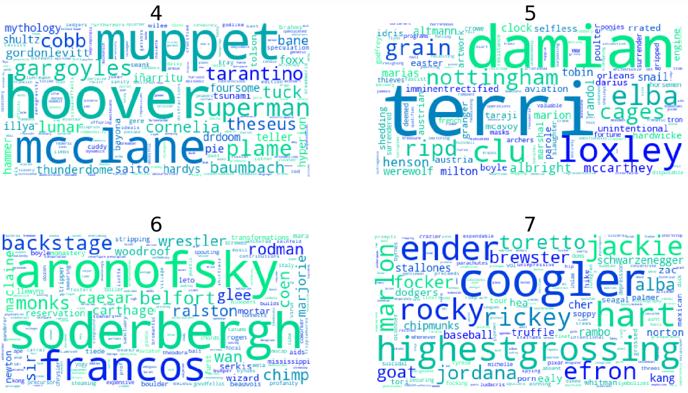
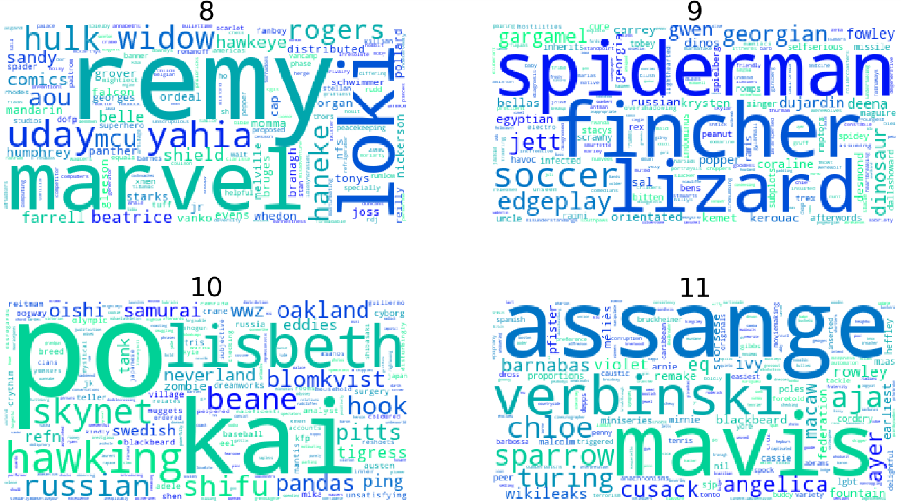
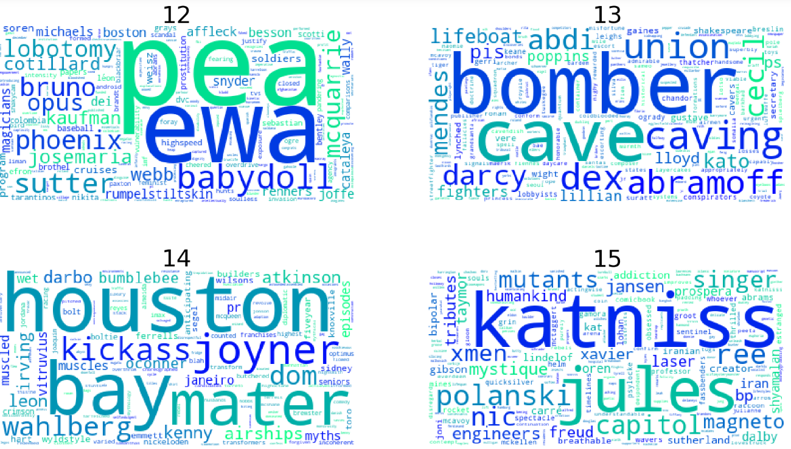
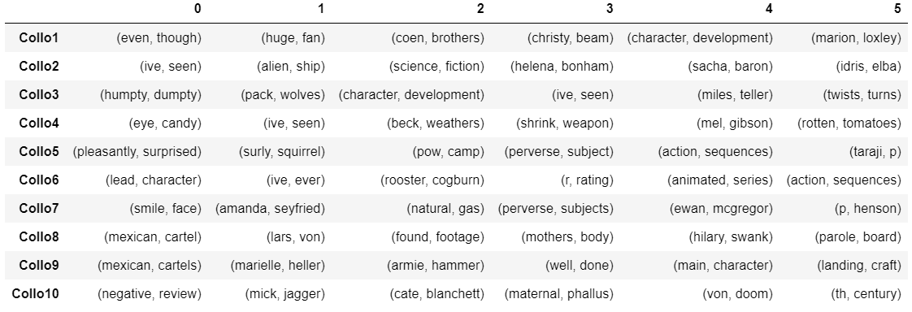
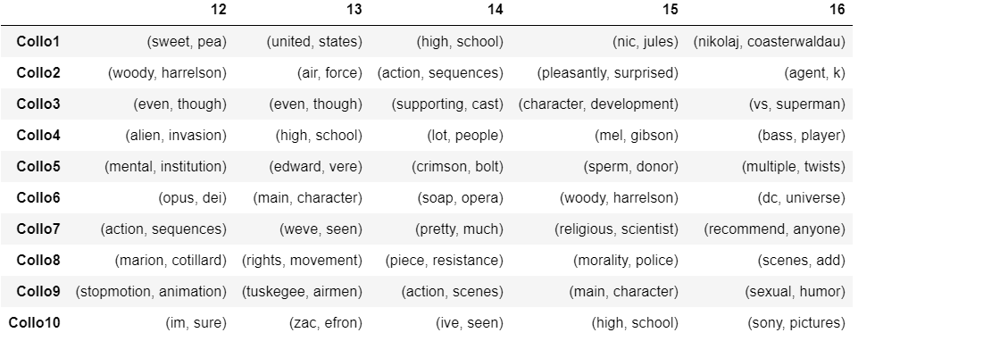

## Investigation of Communities
*Return to [HOME](https://lauramarott.github.io/SocialGraphs/)*

This investigation aims to understand how the movies are connected to each other in communities. The analysis adds a total new perspective to the whole investigation of what makes a movie successful. 
The following parts will be included in this study:
* Community graph
* Understanding the communities
* Review analysis

It is assumed that there are some clear differences between the communities, but how they are connected are exciting to figure out. Come on, let's start!

### Community Graph

The communities are made based on the idea of optimising their internal strength. This is called modularity optimisation which seeks to find the communities that are strongly connected internally, but weakly connected externally i.e. to the other communities. The identified communities can be seen below (with degrees determine the node sizes - see [Investigation of Actors](https://lauramarott.github.io/SocialGraphs/Actors)-section for more info):

<figure style="text-align: center;">
  
</figure>

The modularity is a score for how well connected the communities are and it is between -1 and 1 where 0 corresponds to a random network. The modularity for this community detection is 0.66, thus the communities are well connected. The plot above also shows that the communitites are nicely defined. 

From here it is interesting to see what makes the communities and if this could influence the success of a movie, right?

### Understanding the Communities

The first important thing to do is to see how many communities there are and how many movies each community contains. This makes it easier to investigate further:

<figure style="text-align: center;">
  
</figure>

Now, each of the communities can be investigated on the parameters IMDb-score, Facebook likes, budget and profit all covering the term of being successful. The results can be seen below:

<figure style="text-align: center;">
  
</figure>

In terms of ratings (IMDb-score) all communities are rated around the median. But looking at both Facebook likes and profit, hugh differences can be seen. The Facebook likes fluctuate between aorund 10000 to 50000 likes. The profit varies alot as well where some of them are negative. The extremes might indicate that all movies in the communities acts alike in this regard. Therefore this investigation gives a nice insight into the behaviour of the different communities. However, we still does not have a clear picture of the underlying reason for these communities. One idea is to see how the genres aredistributed to each of the community. 

The table below shows the percentage of the different genres in each community. One important note here is, that each movie often is assigned several genres, thus the number of genre count for each community is higher than the number of movies.

<figure style="text-align: center;">
  
</figure>

This plot shows that some of the genres are assigned many movies and therefore have a high occurency, like drama. But the plot also shows some interesting divisions that could indicate that the communities might be based on genres. This can be seen in for instance community 9 that contains alot of drama, comedy and romance which might indicate that this is so called Chick Flick movies. 

The genres will be investigated further [here](https://lauramarott.github.io/SocialGraphs/Genres).

### Review Analysis

Another way to investigate the communities is through the reviews made by the users. To get an overall understanding of the review behaviour, see the [Review Investigation based on Rankings](https://lauramarott.github.io/SocialGraphs/RankingReviews). 

This analysis are looking into both wordclouds and collocations to see if there are any patterns in the reviews of the communities. 

#### Wordclouds

The wordclouds are made for the reviews of the movies in each community. The wordclouds are taking into account which words are frequent and unique for each community using the TF-IDF (see [Review Investigation based on Rankings](https://lauramarott.github.io/SocialGraphs/RankingReviews) for more information).

The wordclouds for each community can be seen below:

<figure style="text-align: center;">
  
  
  
  
  
</figure>

It can be demanding to go in depth with all wordclouds, but the overall tendency is that the wordclouds supports the finding of the communities belonging to some movie category or genre. An example is community 8 that seems to be superhero movies including the words "Marvel", "Loki", "Widow", "Rogers" (the last three are superhero characters from the movies). 

#### Collocations

The collocations are here the top bigrams for each community to gain another insight into the reviews.

<figure style="text-align: center;">
  
  
  
</figure>

Again, this are not that informative, but looking close into the collocations the patterns from the wordclouds can be confirmed. 

### Conclusion

It can be conlcuded that it is difficult to see what exactly connects the movies. It might be relevant to look into even more parameters to clarify what is behind the communities. However, the review analysis indicates that the communities might be based on some movie categories or genres. Therefore, it might be interesting for you, to jump to the [Investigation of Genres](https://lauramarott.github.io/SocialGraphs/Genres). Otherwise, you can go back to [home](https://lauramarott.github.io/SocialGraphs/) and look into other analyses. Enjoy!
