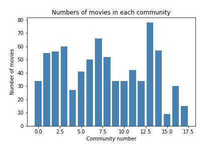

## Investigation of Communities
*Return to [HOME](https://lauramarott.github.io/SocialGraphs/)*

This investigation aims to understand how the movies are connected to each other in communities. The analysis adds a total new perspective to the whole investigation of what makes a movie successful. 
It is assumed that there are some clear differences between the communities, but how they are connected are exciting to figure out. Come on, let's start!

### Community Graph

The communities are made based on the idea of optimising their modularity. The modularity optimisation seeks to find the communities that are strongly connected internally, but weakly connected externally i.e. to the other communities. The identified communities can be seen below:

<figure style="text-align: center;">
  
</figure>

The modularity is a score for how well connected the communities are and it is between -1 and 1 where 0 corresponds to a random network. The modularity for this community detection is 0.66, thus the communities are well connected. The plot above also shows that the communitites are nicely defined. 

From here it is interesting to see what makes the communities and if this could influence the success of a movie.

### Understanding the Communities

<figure style="text-align: center;">
  
</figure>

### Review Analysis
#### Wordclouds

#### Collocations
