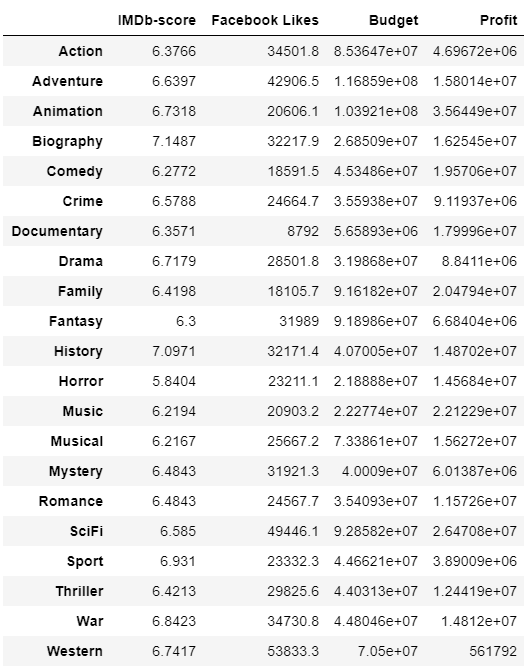
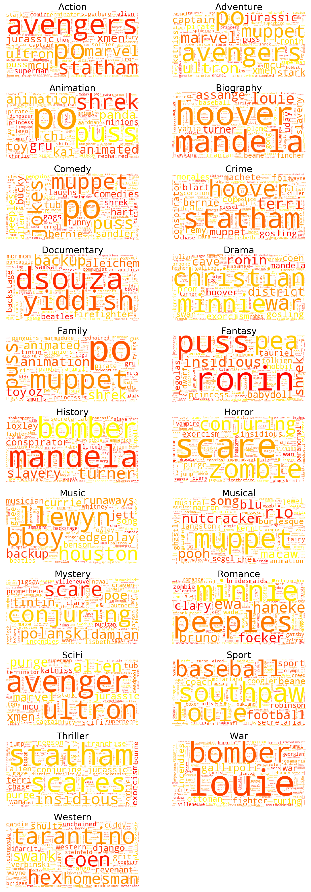
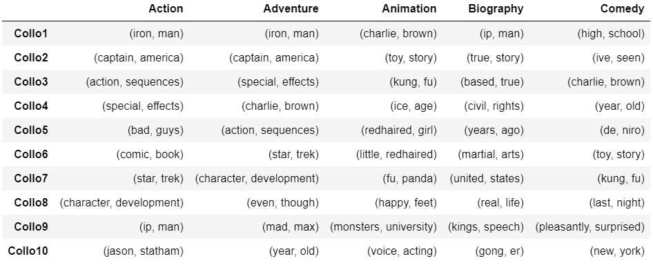
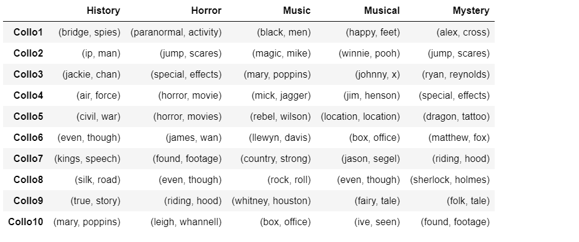
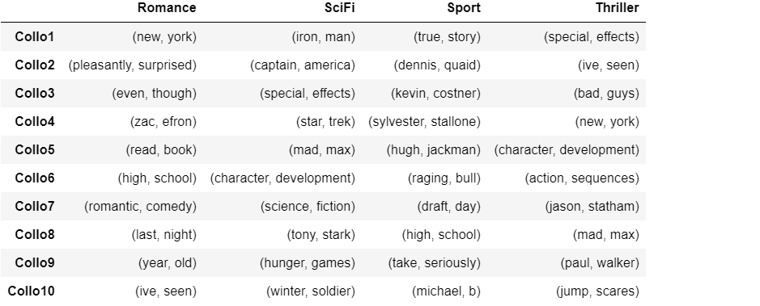
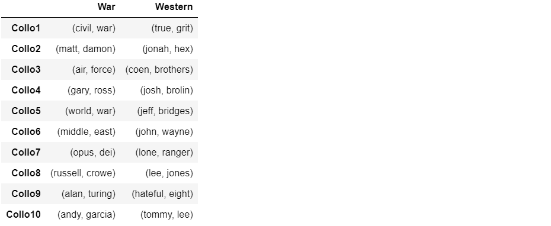
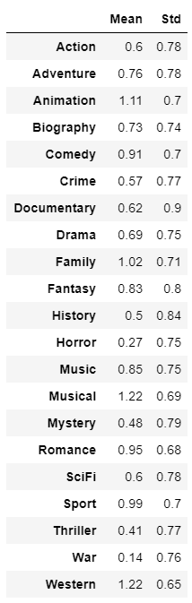
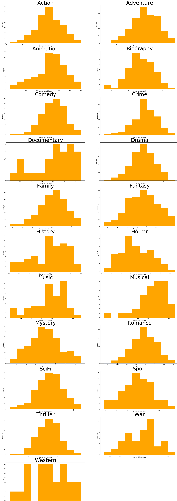
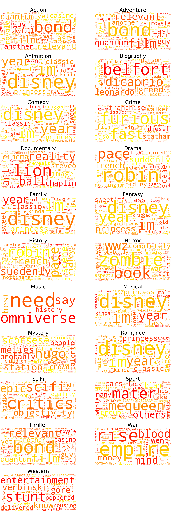
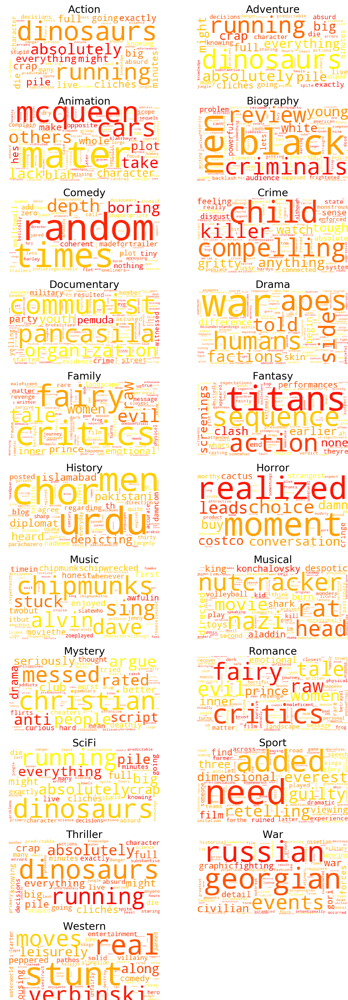

## Investigation of Genres

### Understanding the Genres

<figure style="text-align: center;">
  
</figure>

### Wordclouds
<figure style="text-align: center;">
  
</figure>

### Collocations

<figure style="text-align: center;">
  
  
  
  
  
</figure>

### Sentiment Analysis

<figure style="text-align: center;">
  
</figure>

<figure style="text-align: center;">
  
</figure>

#### Positive Wordclouds

<figure style="text-align: center;">
  
</figure>

#### Negative Wordclouds

<figure style="text-align: center;">
  
</figure>

### Conclusion
