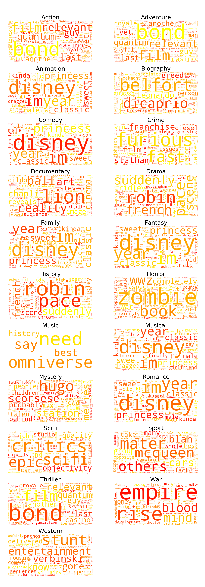
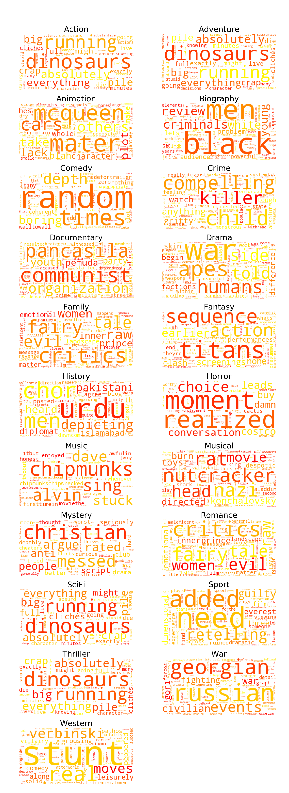

## Investigation of Genres
*Return to [HOME](https://lauramarott.github.io/SocialGraphs/)*

The genres are investigated to see how they relate to the success of a given movie. In the dataset one movie can be assigned several genre and therefore each movie can be a part of more genres in the below analyses. 
The investigation here consists of the following parts:
* Understanding the Genres
* Wordclouds
* Collocations
* Sentiment Analysis
  * Positive Wordclouds
  * Negative Wordclouds

Let us dive into it!

### Understanding the Genres

The first thing is to understand the behaviour of the genres in terms of successfulness, which is here evaluated on the parameters IMDb-score (rating), Facebook likes, budget and profit:

<figure style="text-align: center;">
  
</figure>

First of all, the above shows that all movies have a rating around the median at 6.5 found in the [Basic Stats](https://lauramarott.github.io/SocialGraphs/BasicStats) but some outliers are seen. For instance, Biography and History have a high average rating. The reason for this might be that they are "niche-movies", where the viewers are really interested in that kind of movies and therefore give high ratings. 

In terms of profit, Animation and SciFi have the highest profit. These movies contains many special effects which indicates that this is what the viewers want to see. 

This have provided an overview of how the genres behaves compared to each other. We are now ready to continue the investigation. 

### Wordclouds

The wordclouds are made based on the IMDb-user reviews. The wordclouds shows which words af frequent and unique for each genre, taking into account how unique the given word is across the different genres. For more information of the review behaviour, see [Review Investigation based on Rankings](https://lauramarott.github.io/SocialGraphs/RankingReviews).

The wordclouds for each genre can be seen below:

<figure style="text-align: center;">
  
</figure>

The words in the wordclouds are very consistant with the words known for each genre, for instance in the Horror wordcloud where the biggest words are "scare" and "zombie". 
It is also clear that some of the movies reappear in more genres, for instance "avengers" being big in both Action, Adventure and SciFi. This complicates the possibility of making clear conclusions for the different genres when the movies reappear in such an extent. 

### Collocations

Another way to analyse the reviews is through collocations, here being bigrams that shows the frequent two words occuring together. The top ten collocations for each genre is shown below:

<figure style="text-align: center;">
  
  
  
  
  
</figure>

The collocations confirms the themes of the different genres, but are also providing further insight, for instance Drama including bigrams like "character development", "pleasently surprised" and "subject matter".

### Sentiment Analysis

<figure style="text-align: center;">
  
</figure>

<figure style="text-align: center;">
  
</figure>

#### Positive Wordclouds

<figure style="text-align: center;">
  
</figure>

#### Negative Wordclouds

<figure style="text-align: center;">
  
</figure>

### Conclusion
