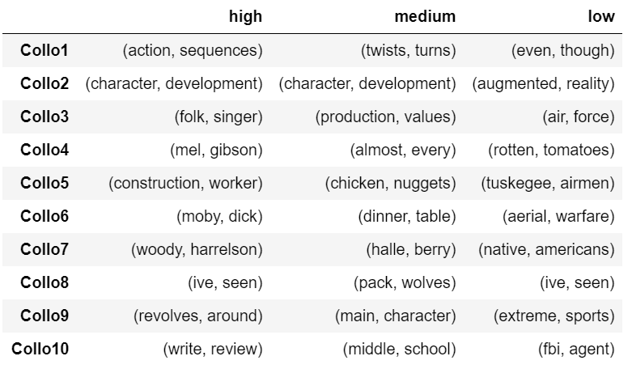

## Review Investigation based on Rankings
*Return to [HOME](https://lauramarott.github.io/SocialGraphs/)*

This investagation aims to analyse the three ranking groups found based on the 33 % and 66 % percentile from [Basic Stats](https://lauramarott.github.io/SocialGraphs/BasicStats). Here, the user reviews of the movies are analysed using text analysis. Hopefully, this text analysis will provide insight in what the users think and experiences regarding the three rating groups.

This text analysis is divided into three parts:
* Wordclouds 
* Collocations
* Sentiment analysis

Let's go!

### Wordclouds

Wordclouds are used to get an overview of what people think about movies in ranked differently. The wordclouds are showing the most frequent word for each ranking category, but it is taken into account how unique a given word is across all three ranking categories (by using [TF-IDF](https://monkeylearn.com/blog/what-is-tf-idf/)). The size of the words in the wordclouds represent frequency and uniqueness of the given word in the given category - the bigger the word is, the more frequent and unique the word is.

The three wordclouds are seen below:

<figure style="text-align: center;">
  
  
  
</figure>

If you did not know which wordcloud belong to which category, would you then have been able to guess it? No, right?
The outcome of the wordclouds are not very informative regarding the experiences when waching the movies. The main usage of these wordclouds is the fact that different movie contents can be seen in the different wordclouds. 

### Collocations

<figure style="text-align: center;">
  
</figure>

### Sentiment Analysis
