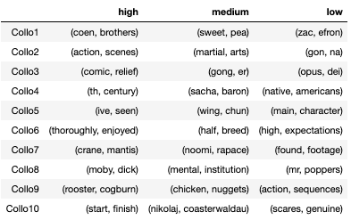

## Review Investigation based on Rankings
*Return to [HOME](https://lauramarott.github.io/SocialGraphs/)*

This investigation aims to analyse the three ranking groups found based on the 33 % and 66 % percentile from the [Understanding the Movie Data](https://lauramarott.github.io/SocialGraphs/BasicStats)-section. Here, the user reviews of the movies are analysed using Text Analysis. Hopefully, this text analysis will provide insight in what the movie-wathcers think and experience regarding the movies in the three rating groups.

This text analysis is divided into three parts:
* Wordclouds 
* Collocations
* Sentiment analysis

The assumption before going into this analysis is that the high ranked movies have more positive reviews and vice versa. 

Let's go!

### Wordclouds

Wordclouds are used to get an overview of what people think about movies ranked differently. The wordclouds are showing the most frequent word for each ranking category, but it is taken into account how unique a given word is across all three ranking categories (by using [TF-IDF](https://monkeylearn.com/blog/what-is-tf-idf/)). The size of the words in the wordclouds represent frequency and uniqueness of the given word in the given category - the bigger the word is, the more frequent and unique it is too.

The three wordclouds are seen below:

<figure style="text-align: center;">
  
  
  
</figure>

If you did not know which wordcloud belong to which category, would you then have been able to guess it? No, right?
The outcome of the wordclouds are not very informative regarding the experiences when waching the movies. The main usage of these wordclouds is the fact that different movie contents can be seen in the different wordclouds. 

### Collocations

Another way to explore the reviews is the collocation which in this case find the most frequent bigrams (words occuring two and two). Hopefully, this will tell us more about the reviews since the words used together is found which makes it possible to learn a little more about the context of the used words. 

<figure style="text-align: center;">
  
</figure>

The collocations are not that informative either. It is difficult to see if there is any patterns in what words are used when reviewing the different ranked movies. 

### Sentiment Analysis

It is necessary for us to rethink the text analysis! The individual words (and the bigrams) have not been informative, thus a sentiment analysis is made on each ranking category to see if the ranking correlates to the sentiment of the reviews. The sentiment analysis is based on the idea that some words are more or less positive and negative than others. Therefore, the words are assigned "scores" and the mean sentiment for each review in each ranking category is calculated resulting in the sentiment distributions. It is assummed that the sentiment for the high ranked movies are higher than for the low ranked movies. 

First, the average sentiment scores and standard deviations are shown for each category:

<figure style="text-align: center;">
  
</figure>

From this table it is clear that the assumption about high ranked movies having the highest average sentiment score, the medium ranked having the middle sentiment score, and the low ranked movies having the lowest sentiment score. The full sentiment distributions are also interesting to take a look at:

<figure style="text-align: center;">
  
  
  
</figure>

These distributions strengthen the assumption above, but with some outliers. 

### Conclusion

To sum up it has here been clear that the reviews cannot be used to see *what* makes a movie good or bad in regard of the rankings. But the sentiment analysis shows that there are a difference, since this follows the assumption of reviews sentiment correspondong to the ranks. 

This interesting investigation have now provided more insight in how people review, and further text analyses based on other divisions can be made. Feel free to go back to [home](https://lauramarott.github.io/SocialGraphs/) to continue your investigation!
