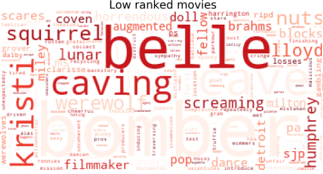
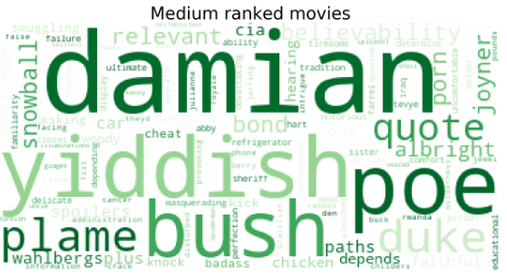
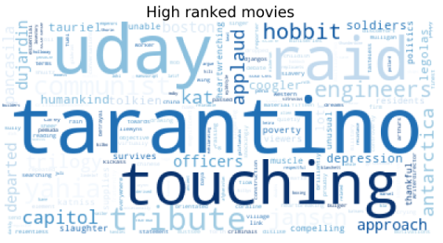

## Review Investigation based on Rankings
*Return to [HOME](https://lauramarott.github.io/SocialGraphs/)*

This investagation aims to analyse the three ranking groups found based on the 33 % and 66 % percentile from [Basic Stats](https://lauramarott.github.io/SocialGraphs/BasicStats). Here, the user reviews of the movies are analysed using text analysis. Hopefully, this text analysis will provide insight in what the users think and experiences regarding the three rating groups.

This text analysis is divided into three parts:
* Wordclouds 
* Collocations
* Sentiment analysis

Let's go!

### Wordclouds

Wordclouds are used to get an overview of what people think about movies in ranked differently. The wordclouds are showing the most frequent word for each ranking category, but it is taken into account how unique a given word is across all three ranking categories (by using [TF-IDF](https://monkeylearn.com/blog/what-is-tf-idf/)).

The three wordclouds are seen below:

<figure style="text-align: center;">
  
  
  
</figure>

### Collocations

### Sentiment Analysis
